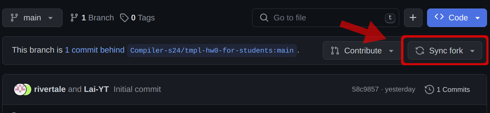
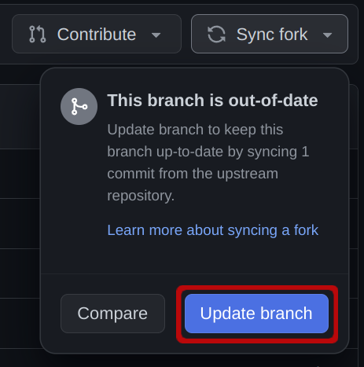
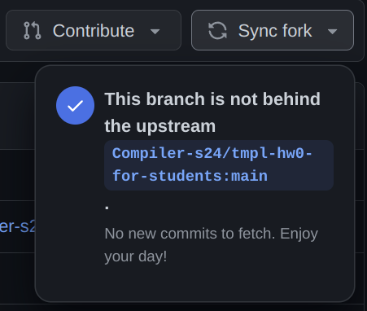

Title: [PATCH] Fix missing substitution

Labels: announcement, hw0

Written by: Lai-YT

---

Dear @Compiler-s24/students,

For Assignment 0, we've made a mistake that overwrote the substitution string. It should display the time and the docker environment flag in the README.md after students update their information with make (See [#3](https://github.com/Compiler-s24/Discussion/issues/3)).

We've merged a _fix_ into the [template repository](https://github.com/Compiler-s24/tmpl-hw0-for-students) to address the issue. For students who have accepted the assignment before the change was made, we kindly request that you sync up with the fork by merging this change into your own repository. Here are the steps:

1. Navigate to your own repository `hw0-xxx`. You should see the "Sync fork" button showing up.

1. Click the "Sync fork" button and then click "Update branch". (If you directly see the result of the next step, you are already up-to-date. :smile:)
<br><br>
1. The update takes a few seconds and should complete without conflict[^1].
<br><br>
1. Pull the repository to make the local repository up-to-date as well and re-`make` to update the information.
  ```sh
  git pull origin main
  make
  # git commit and git push
  ```

If you encounter any issues during the merging process, please let me know 🙌 .

[^1]: This may not always be true. If the same code modified by this PR is also changed by you, there exists a [merge conflict](https://www.atlassian.com/git/tutorials/using-branches/merge-conflicts). In such cases, GitHub converts the sync into a pull request to resolve the conflict, and you may need to resolve conflicts manually 😢 . For more details, please refer to the [official documentation](https://docs.github.com/en/pull-requests/collaborating-with-pull-requests/working-with-forks/syncing-a-fork).

> [!note]
> In the future, if there are any modifications to the assignment after its initial release, they will also be distributed this way. So, we encourage you to ask if you don't understand how this works.
